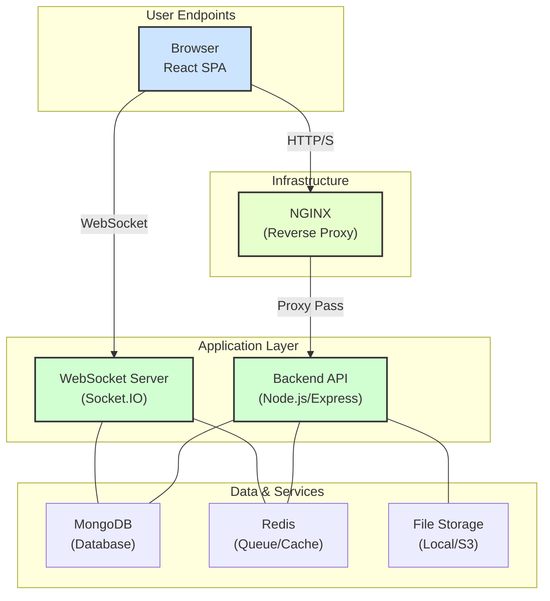

# WorkSpace Pro - Real-time Collaboration Platform

<div align="center">

[](https://github.com/bpdtaran/collab-platform/actions)
[](https://opensource.org/licenses/MIT)

</div>

**WorkSpace Pro** is a full-stack, real-time collaboration platform designed for modern teams. It features a responsive frontend built with **React & Material-UI** and a robust backend powered by **Node.js, Express, and MongoDB**. The platform supports concurrent document editing, workspace management with role-based access, full-text search, and more, all facilitated by **Socket.IO** for a seamless, live experience.

---

## ✨ Key Features

-   **🚀 Real-time Document Editing**: Multiple users can edit the same document simultaneously, with changes and cursors broadcasted instantly.
-   **🗂️ Workspace Management**: Organize documents and teams into separate, secure workspaces.
-   **🔐 Secure Authentication**: Robust user registration and login using JWT (Access + Refresh Token flow) with `bcryptjs` hashing.
-   **👥 Role-Based Access Control (RBAC)**: Assign roles (`Owner`, `Editor`, `Reader`) to users within each workspace to manage permissions.
-   **🔍 Full-Text Search**: Quickly find documents across workspaces with relevance-based scoring using MongoDB's native text indexes.
-   **📎 File Uploads**: Attach images to documents with size and MIME type validation, served from the backend.
-   **Background Jobs**: Asynchronous tasks like sending email invitations are handled efficiently by a **BullMQ** queue with Redis.
-   **🐳 Dockerized Environment**: Fully containerized for one-command setup and consistent development/production environments.

---

## 🛠️ Tech Stack

| Category      | Technology                                                                                                                                                             |
| :------------ | :--------------------------------------------------------------------------------------------------------------------------------------------------------------------- |
| **Frontend**  |     |
| **Backend**   |                 |
| **Database**  |                                                                                                     |
| **Queue**     |                                              |
| **DevOps**    |    |

---

## 🏗️ Architecture

The application follows a decoupled monorepo structure. The backend exposes a RESTful API and a WebSocket server, while the React frontend consumes these services.



---

## 🚀 Getting Started

### Prerequisites

-   [Node.js](https://nodejs.org/) (v18.x or later)
-   [Docker](https://www.docker.com/) & [Docker Compose](https://docs.docker.com/compose/)
-   A Git client

### 📦 Setup & Run with Docker (Recommended)

This is the easiest method to get the entire stack (frontend, backend, database, queue) running with a single command.

1.  **Clone the Repository**
    ```bash
    git clone https://github.com/bpdtaran/collab-platform.git
    cd collab-platform
    ```

2.  **Create Environment Files**
    Copy the example `.env` files for both services. The defaults are pre-configured for Docker.
    ```bash
    cp backend/.env.example backend/.env
    cp frontend/.env.example frontend/.env
    ```

3.  **Build and Run the Containers**
    From the root `collab-platform` directory, run:
    ```bash
    docker-compose up --build
    ```

4.  **Access the Application**
    -   **Frontend:** [http://localhost:3000](http://localhost:3000)
    -   **Backend API Health:** [http://localhost:5000/api/health](http://localhost:5000/api/health)

---

### 🖥️ Local Setup for Windows (Without Docker)

If you prefer to run the services directly on your Windows machine, follow these steps.

#### 1. Install Prerequisites

You must install and run the following software on your machine:

-   **Git**: [Download Git for Windows](https://git-scm.com/download/win) and install it. This allows you to clone the repository.
-   **Node.js**: [Download Node.js](https://nodejs.org/en/) (v18.x or later). This includes `npm`.
-   **MongoDB Community Server**: [Download MongoDB](https://www.mongodb.com/try/download/community). During installation, make sure to also install **MongoDB Compass** (the GUI) and configure MongoDB to run as a **network service**.
-   **Redis**: Redis does not have official support for Windows. The recommended way is to use **WSL2 (Windows Subsystem for Linux)**.
    1.  [Follow this guide to install WSL2 and a Linux distribution like Ubuntu](https://learn.microsoft.com/en-us/windows/wsl/install).
    2.  Open your Ubuntu terminal and run:
        ```bash
        sudo apt-get update
        sudo apt-get install redis-server
        sudo service redis-server start
        ```
    3.  Your Redis server will now be running and accessible from your Windows applications at `localhost:6379`.

#### 2. Clone the Repository

Open a terminal (like Git Bash or Windows Terminal) and run:

```bash
git clone https://github.com/bpdtaran/collab-platform.git
cd collab-platform
```

#### 3. Configure the Backend

1.  Navigate to the `backend` directory:
    ```bash
    cd backend
    ```

2.  Install dependencies:
    ```bash
    npm install
    ```

3.  Create your local environment file. Use `copy` on Windows:
    ```bash
    copy .env.example .env
    ```

4.  **Edit the `backend/.env` file** and make sure the variables point to your local services:
    ```env
    PORT=5000
    MONGODB_URI=mongodb://127.0.0.1:27017/collab-platform
    FRONTEND_URL=http://localhost:3000
    REDIS_HOST=localhost
    REDIS_PORT=6379
    # Make sure to set strong, random secrets
    ACCESS_TOKEN_SECRET=your_super_secret_access_key_for_dev
    REFRESH_TOKEN_SECRET=your_super_secret_refresh_key_for_dev
    ```

#### 4. Configure the Frontend

1.  Navigate to the `frontend` directory from the root:
    ```bash
    cd ../frontend
    ```
    *(If you are already in the `backend` directory, this command will work)*

2.  Install dependencies:
    ```bash
    npm install
    ```

3.  Create your local environment file:
    ```bash
    copy .env.example .env
    ```
    *Note: The default values in this file should work correctly for a local setup, so you may not need to edit it.*

#### 5. Run the Application

You will need **two separate terminals** running at the same time.

1.  **In your first terminal**, start the backend server:
    ```bash
    cd path\to\collab-platform\backend
    npm run dev
    ```
    You should see `🚀 Server running on port 5000` and `✅ MongoDB connected`.

2.  **In your second terminal**, start the frontend application:
    ```bash
    cd path\to\collab-platform\frontend
    npm start
    ```
    Your browser should automatically open to [http://localhost:3000](http://localhost:3000).

#### Troubleshooting on Windows

-   **MongoDB/Redis Connection Errors**: Make sure the MongoDB and Redis services are running *before* you start the backend server.

-   **`node-gyp` errors during `npm install`**: Some packages require C++ build tools. If you see errors related to `node-gyp`, run this command in a terminal with **Administrator privileges**:
    ```bash
    npm install --global windows-build-tools
    ```
    Then, delete your `node_modules` folder and run `npm install` again.

-   **Port Conflicts**: If another application is using port `3000` or `5000`, you can change them in the `.env` files for the respective service.

---

## ⚙️ Environment Variables

### Backend (`/backend/.env`)

| Variable               | Description                                           | Example                                  |
| ---------------------- | ----------------------------------------------------- | ---------------------------------------- |
| `PORT`                 | Port for the backend server.                          | `5000`                                   |
| `MONGODB_URI`          | MongoDB connection string.                            | `mongodb://mongo:27017/collab-platform`  |
| `ACCESS_TOKEN_SECRET`  | Secret key for signing JWT access tokens.             | `replace_with_a_strong_random_string`    |
| `REFRESH_TOKEN_SECRET` | Secret key for signing JWT refresh tokens.            | `replace_with_another_strong_string`     |
| `FRONTEND_URL`         | Frontend URL for CORS configuration.                  | `http://localhost:3000`                  |
| `REDIS_HOST`           | Hostname for the Redis server.                        | `redis`                                  |
| `REDIS_PORT`           | Port for the Redis server.                            | `6379`                                   |

### Frontend (`/frontend/.env`)

| Variable               | Description                                  | Example                       |
| ---------------------- | -------------------------------------------- | ----------------------------- |
| `REACT_APP_API_URL`    | Base URL for the backend REST API.           | `http://localhost:5000/api`   |
| `REACT_APP_SOCKET_URL` | Base URL for the backend WebSocket server. | `http://localhost:5000`         |

---

## 🧪 CI & Available Scripts

This project uses **GitHub Actions** for continuous integration. The CI pipeline (`.github/workflows/ci.yml`) automatically runs linting, testing, and build checks on every push to `main`.

**Common scripts:**

| Service  | Command         | Description                                |
| :------- | :-------------- | :----------------------------------------- |
| Backend  | `npm run dev`   | Starts the backend server with `nodemon`.  |
|          | `npm run lint`  | Lints the backend codebase with ESLint.    |
|          | `npm test`      | Runs backend tests with Jest.              |
| Frontend | `npm start`     | Starts the frontend development server.    |
|          | `npm run build` | Creates a production build of the app.     |
|          | `npm test`      | Runs frontend tests.                       |

---

## 💡 Trade-offs & Known Issues

-   **Real-time Conflict Resolution**: The current implementation uses a **Last-Write-Wins (LWW)** strategy with versioning for concurrent edits. This is simple but can lead to lost data in high-contention scenarios. A more robust solution would involve **Operational Transformation (OT)** or **CRDTs**.

-   **Search Scalability**: Search is handled by MongoDB's native `$text` index, which is suitable for small to medium-sized datasets. For large-scale applications, integrating a dedicated search engine like **Elasticsearch** or **Meilisearch** would offer better performance and more advanced features.

-   **File Storage**: Uploads are stored on the local filesystem. This is not scalable for production. The system is designed to be easily switched to a cloud storage provider like **AWS S3**.

-   **Background Jobs**: The email queue is set up but only logs to the console. A real implementation requires configuring an email service provider (e.g., SendGrid, Mailgun) and creating email templates.
```